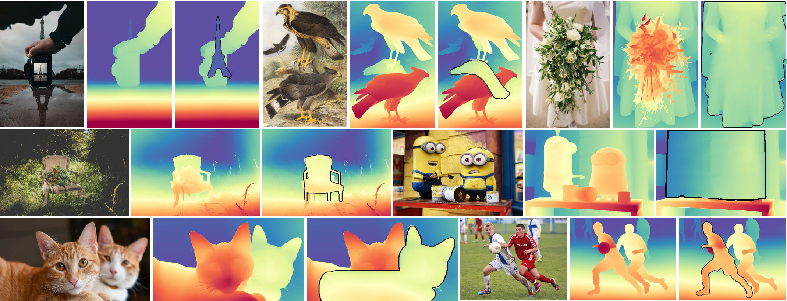

<div align="center">
<h1>Amodal Depth Anything </h1>
<h3>Amodal Depth Estimation in the Wild</h3>

[](https://zhyever.github.io/amodaldepthanything/) [](tbd)  [](https://huggingface.co/zhyever/Amodal-Depth-Anything-DAV2) [](https://opensource.org/licenses/MIT)

<!-- [](tbd) -->

<a href="https://zhyever.github.io/">Zhenyu Li<sup>1</sup></a>, <a href="https://scholar.google.com/citations?user=-oFR-RYAAAAJ&hl=en">Mykola Lavreniuk<sup>2</sup></a>, <a href="https://www.linkedin.com/in/jian-shi-1ba543110/?originalSubdomain=cn">Jian Shi<sup>1</sup></a>, <a href="https://shariqfarooq123.github.io/">Shariq Farooq Bhat<sup>1</sup></a>, <a href="https://peterwonka.net/">Peter Wonka<sup>1</sup></a>. 
<br>KAUST<sup>1</sup>, Space Research Institute NASU-SSAU<sup>2</sup>

<center>

</center>

</div>

## ✨ **NEWS**
- 2024-12-01: Initially release [project page](https://zhyever.github.io/amodaldepthanything/), [paper](tbd), [codes](https://github.com/zhyever/Amodal-Depth-Anything), and [offline demo](https://github.com/zhyever/Amodal-Depth-Anything).

## 💻 **Environment setup**

Install environment using `environment.yaml` : 

Using [mamba](https://github.com/mamba-org/mamba) (fastest):
```bash
mamba env create -n amodaldepth --file environment.yaml
mamba activate amodaldepth
```
Using conda : 

```bash
conda env create -n amodaldepth --file environment.yaml
conda activate amodaldepth
```

Install [pix2gestalt](https://github.com/cvlab-columbia/pix2gestalt):
```bash
git clone https://github.com/cvlab-columbia/pix2gestalt.git
mv ./pix2gestalt ./pix2gestalt_raw
mv ./pix2gestalt_raw/pix2gestalt ./pix2gestalt
rm -rf ./pix2gestalt_raw
```

Install [taming-transformers](https://github.com/CompVis/taming-transformers) and [CLIP](https://github.com/openai/CLIP):
```bash
git clone https://github.com/CompVis/taming-transformers.git
pip install -e taming-transformers/
git clone https://github.com/openai/CLIP.git
pip install -e CLIP/
```

## 🛠️ Models

### Pretrained Models
| Model | Checkpoint |  Description | 
|:-|:-:| :-:| 
| Base Depth-Anything-V2 Model | [Download](https://huggingface.co/zhyever/Amodal-Depth-Anything/resolve/main/base_depth_model/amodal_depth_anything_base.pth) | Base depth model. Save to `work_dir/ckp/amodal_depth_anything_base.pth` |
| Amodal-Depth-Anything Model | [HuggingFace Model](https://huggingface.co/zhyever/Amodal-Depth-Anything-DAV2h) | Amodal depth model. Automatically downloading |
| SAM | [Download](https://gestalt.cs.columbia.edu/assets/sam_vit_h.pth) | Segmentation model. Save to `work_dir/ckp/pix2gestalt/sam_vit_h.pth` |
| pix2gestalt | [Download](https://gestalt.cs.columbia.edu/assets/sd-image-conditioned-v2.ckpt) | Amodal segmentation model. Save to `work_dir/ckp/pix2gestalt/epoch=000005.ckpt` | 

### Download 
```bash
wget -c -P ./work_dir/ckp/ https://huggingface.co/zhyever/Amodal-Depth-Anything/resolve/main/base_depth_model/amodal_depth_anything_base.pth
wget -c -P ./work_dir/ckp/pix2gestalt/ https://gestalt.cs.columbia.edu/assets/sam_vit_l.pth
wget -c -P ./work_dir/ckp/pix2gestalt/ https://gestalt.cs.columbia.edu/assets/epoch=000005.ckpt
```

## 🤔 Folder Structure
Before executing the code, make sure the folder structure is as follows:

```none
Amodal-Depth-Anything
├── assets
├── CLIP
├── config
├── data_split
├── data_split
├── pix2gestalt
│   ├── configs
│   ├── ldm
│   ├── ... other files
├── src
├── taming-transformers
├── work_dir
│   ├── ckp
│   │   ├── amodal_depth_anything_base.pth
│   │   ├── pix2gestalt
│   │   │   ├── epoch=000005.ckpt
│   │   │   ├── sam_vit_h.pth
├── app.py
├── ... other files
```

## 🚀 Inference

### With Image and Amodal Mask
Run our `infer.py` to estimate amodal depth based on the input image and amodal mask:
```bash
python ./infer.py --input_image_path ./assets/inference_examples/case1.jpg --input_mask_path ./assets/inference_masks/case1_mask.png --output_folder ./assets/results/
```

Have no idea how to get amodal masks? Try our offline demo that implements both Model Heuristics (with the power of pix2gestalt) and Human Heuristics (drawing masks manually) modes
### Offline Demo
Run our offline demo `app.py` to start the offline demo:
```bash
python ./app.py
```

After that, you would see the following message:
```bash
... tons of logs
Running on local URL:  http://127.0.0.1:7860
Running on public URL: https://xxxx.gradio.live
```
Simply open the local URL in your browser to start the demo.

<!-- ## 🎓 Citation
```bibtex
@InProceedings{x,
      title={Amodal Depth Anything: Amodal Depth Estimation in the Wild},
      author={x},
      booktitle = {x},
      year={2024}
}
``` -->

## **TBD**
- 2024-12-01: Online Gradio Demo
- 2024-12-01: Dataset Preparation and Training Docs
